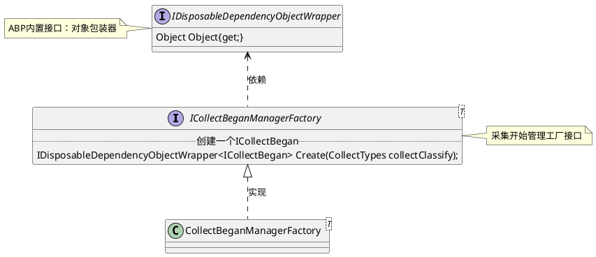

 
1. 安装java环境
2. 安装 GraphViz 程序
   1. [下载地址](https://graphviz.gitlab.io/_pages/Download/Download_windows.html)
   2. 将安装的可执行文件地址`C:\Program Files (x86)\Graphviz2.38\` bin 放入path
   3. dot -v
3. 安装 plantuml插件
4. alt + d 自动生成

 